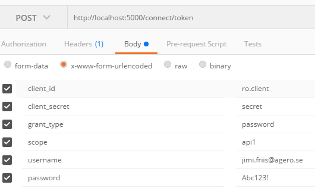
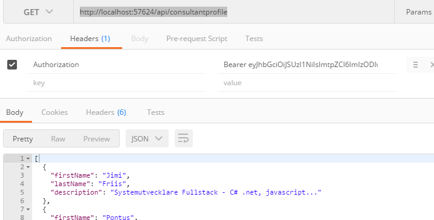

# .Net core Web Api Projektanteckningar/Steps
### Projektkrav 
Applikationen ska visa en lista av konsultprofiler
- En profil består av Förnamn, Efternamn och en Beskrivning

Som en anonym användare kan jag
- Registrera mig
- Se förnamn på profilerna
	
Som en registrerad användare kan jag
- Se all information i konsultprofilerna


## Skapa nytt projekt för API
- Lägg till nytt projekt, ASP.NET Core Web Application (.NET Core)
ange namn, profil.api, välj Empty template.

- Starta appen i Debug för att verifera att du får upp en browser med meddelandet "Hello World!"

I [Program.cs](Program.cs) finns inställningarna för webbservern, t ex om vi vill köra IIS Express eller något annat, vi låter dessa vara som de är.

I [Startup.cs](Startup.cs)  konfigurerar man "service dependencies" (i metoden ConfigureServices) och  HTTP Request pipeline (i metoden Configure)

#### Http Request pipeline
*i Startup.cs > Configure*
- Http Request pipeline består av ett antal "middlewares" vilka kopplas på IApplicationBuilder (app)
vanliga  middelwares hämtar du från nuget, och du kan så klart skriva egna.
- Ordningen för middlewares är viktig eftersom en middleware tar emot data från föregående middleware, 
gör sin grej och skickar sedan vidare data till nästa i "pipen" (kedjan) [mw 1, mw 2, mw 3] och lyssnar (eventuellt) på resultatet från den/de senare i kedjan [mw 3, mw 2, mw 1]

- Vissa middelwares är "terminal" vilket betyder att de inte skickar data vidare, de är sist i kedjan; 
	några exempel är UseWelcomePage() och Run(), alla middlewares configurerade senare i kedjan kommer alltså inte att köras.

#### Öppna [Startup.cs](Startup.cs)
- och lägg till ett repository för att hämta konsultprofilerna
- med repositoryt [ConsultantProfileRepository.cs](Models/ConsultantProfileRepository.cs) på plats kan vi lägga till en controller för att låta vårt api hämta data.
- för att controllern ska hittas behövs routing, det kan man sätta direkt på controllern som vi visar i koden, alternativt i Startup.cs > Configure (eller både och, controllerns konfig väger tyngst)
exempel: 
	```
	private void ConfigureRoutes(IRouteBuilder routeBuilder)
			{
				routeBuilder.MapRoute("Default",
					"{controller=Home}/{action=Index}/{id?}"); // controller=Home >> om controller name inte hittas (eller inte angavs), redirect till HomeController med default action(metod) Index
			}
	// används i Configure enligt, app.UseMvc(ConfigureRoutes)
	```
- nu har vi ett fungerande api som kan leverera konsultprofiler, nästa steg är att lägga till autentisering vilket vi gör med .Net Core Identity och [Identity Server 4](https://github.com/IdentityServer/IdentityServer4)

## Nytt projekt för IdentityServer och .Net Core Identity
Här följer jag exemplet från [Identity Server Quickstarts > Using ASP.NET Core Identity](https://identityserver4.readthedocs.io/en/release/quickstarts/6_aspnet_identity.html), (det finns även ett [exempelprojekt att ladda ner här](https://github.com/IdentityServer/IdentityServer4.Samples/tree/dev/Quickstarts/6_AspNetIdentity),
med [deras färdiga UI](https://github.com/IdentityServer/IdentityServer4.Quickstart.UI)
### följ stegen från "New Project for ASP.NET Identity" till och med "Creating a user"
#### "Add IdentityServer packages" 
  - när jag uppdaterade alla paket till det senaste misslyckades nuget med restore, vilket löstes genom att uppdatera nuget till senaste beta https://docs.nuget.org/ndocs/guides/install-nuget ,  
  - efter det följde jag denna länk för uppdatering av core till .net core 1.1 https://blogs.msdn.microsoft.com/webdev/2016/11/16/announcing-asp-net-core-1-1/
#### "Configure IdentityServer" 
  - konfiguration av IdentityServer "InMemory" (dvs statisk hårdkodad konfiguration)
  - Med Identity Server på plats kan vi lägga till till Authorization på vårt Api, ConsultantProfileController.Get() > 
    - Än så länge är det öppet att hämta data från http://localhost:57624/api/consultantprofile men nu är det dags att begränsa åtkomsten.
    - Lägg till "Authorize" på Get(), om du försöker hämta data nu får du tillbaks status code "401 Unauthorized"
  - Vi behöver även konfigurera vårt api till att använda vår IdentityServer för autentisering, dvs så att vårt api godkänner tokens utfärdade av vår IdentityServer, detta gör vi i profil.api.Startup
    - Lägg till "IdentityServer4.AccessTokenValidation": "1.0.1" som en dependency i project.json
    - lägg till denna middleware i Startup.Config
#### "Creating the user database" 
  - Eftersom vi använder Identity för användarhanteringen behöver vi initiera databasen, har du som jag uppdaterat .net core till 1.1 följ dessa steg (annars får du varningen "No executable found matching command "dotnet-ef" när du försöker initiera databasen)
    - lägg til följande nugetpaket (https://docs.microsoft.com/en-us/ef/core/miscellaneous/cli/dotnet)   
      - under dependencies: "Microsoft.EntityFrameworkCore.Design": {"type": "build", "version": "1.1.0"}
      - under tools: "Microsoft.EntityFrameworkCore.Tools": "1.1.0-preview4-final",
    "Microsoft.EntityFrameworkCore.Tools.DotNet": "1.1.0-preview4-final",
  - öppna en kommandoprompt i projektkatalogen för vår IdentityServer och kör följande kommandon
      - "dotnet ef migrations add InitialDbMigration" för att skapa vår baseline, detta är inte nödvändigt.
      - "dotnet ef database update" för att initiera databasen.
#### "Creating a user"
  - Starta api och IdentityServer och öppna identityserver (http://localhost:5000) 
  - Registrera en användare (komplexa lösenord, t ex Abc123!, krävs som standard)
  - Nu när vi har en användare kan vi testa vårt api från ett verktyg som [Postman](https://www.getpostman.com/)
    - anropa först IdentityServer, http://localhost:5000/connect/token, från postman med följande inställningar 
      - (client_id, client_secret, grant_type och scope kommer från Config.GetClients(), username och password är från användaren du nyss registrerade)  som svar ska du få ett json-objekt med bla a en "access_token", kopiera access_token och öppna en ny flik för att skapa ett anrop mot vårt api
    - anropa därefter vårt api enligt bilden, http://localhost:57624/api/consultantprofile, med headern "Authorization" "Bearer [tokenstring]"  och som svar bör du nu få data från apiet.
